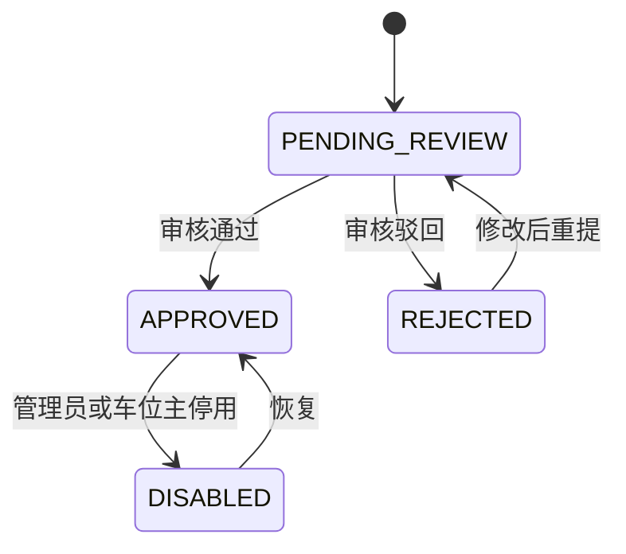
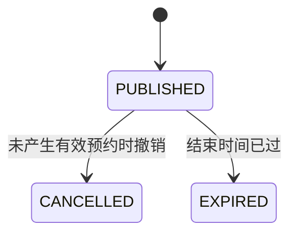
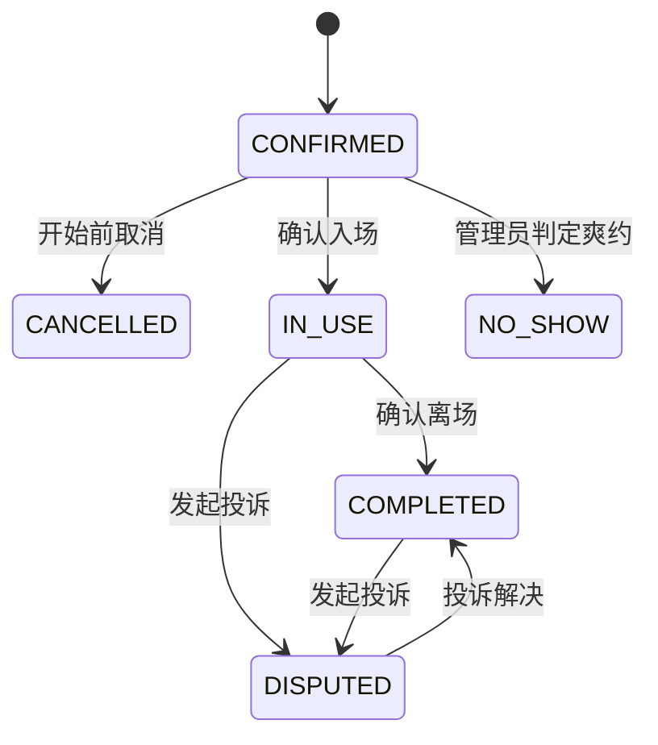
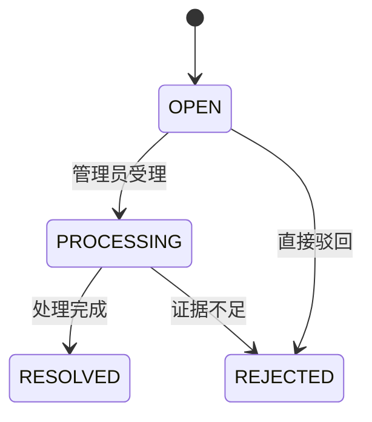

# 状态机

## 车位

```mermaid
stateDiagram-v2
    [*] --> PENDING_REVIEW
    PENDING_REVIEW --> APPROVED: 审核通过
    PENDING_REVIEW --> REJECTED: 审核驳回
    REJECTED --> PENDING_REVIEW: 修改后重提
    APPROVED --> DISABLED: 管理员或车位主停用
    DISABLED --> APPROVED: 恢复
```

## 共享时段

```mermaid
stateDiagram-v2
    [*] --> PUBLISHED
    PUBLISHED --> CANCELLED: 未产生有效预约时撤销
    PUBLISHED --> EXPIRED: 结束时间已过
```

## 预约

```mermaid
stateDiagram-v2
    [*] --> CONFIRMED
    CONFIRMED --> CANCELLED: 开始前取消
    CONFIRMED --> IN_USE: 确认入场
    CONFIRMED --> NO_SHOW: 管理员判定爽约
    IN_USE --> COMPLETED: 确认离场
    IN_USE --> DISPUTED: 发起投诉
    COMPLETED --> DISPUTED: 发起投诉
    DISPUTED --> COMPLETED: 投诉解决
```

所有状态变更必须校验当前状态和操作者权限；非法变更返回 `INVALID_STATE_TRANSITION`。

## 投诉

```mermaid
stateDiagram-v2
    [*] --> OPEN
    OPEN --> PROCESSING: 管理员受理
    OPEN --> REJECTED: 直接驳回
    PROCESSING --> RESOLVED: 处理完成
    PROCESSING --> REJECTED: 证据不足
```
