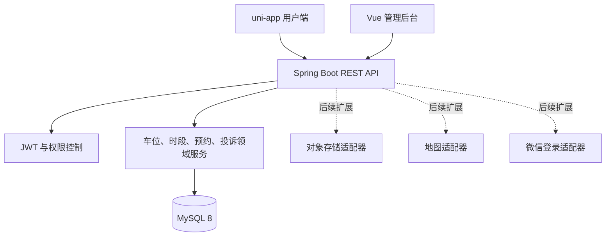

# 系统架构

## 1. 组件



阶段 2默认使用本地受控存储和开发身份登录，外部供应商通过接口隔离，生产环境不得启用开发登录。

## 2. 模块边界

服务端采用按业务领域分包：

```text
com.neighborparking
├── config
├── domain
├── repository
├── security
├── service
├── web
└── common
```

控制器负责协议转换与参数校验；事务、资源归属校验和状态变更位于服务层。公开搜索与订单详情使用专用响应视图，受权限保护的基础管理列表在 MVP 阶段直接返回无密钥的持久化视图。

## 3. 并发控制

创建预约时按以下顺序执行：

1. 使用悲观写锁读取发布时段。
2. 校验时段状态、车位状态、所有权和预约区间。
3. 查询同车位重叠的活动订单。
4. 如果存在重叠立即返回 `BOOKING_TIME_CONFLICT`。
5. 创建 `CONFIRMED` 订单并提交事务。

重叠条件统一为 `existing.start_at < requested.end_at AND existing.end_at > requested.start_at`。

## 4. 身份与权限

JWT 中保存用户 ID 和签发时的角色快照，有效期默认为 120 分钟；角色调整后通过重新登录刷新权限。开发登录由 `APP_AUTH_DEV_ENABLED` 控制，生产配置必须为 `false`。

## 5. 配置

- 默认 `local`：H2 内存库、演示数据、开发登录。
- `mysql`：MySQL 8、Flyway、外部化 JWT 密钥。
- 任何密钥均通过环境变量注入。

## 6. 可观测性

- API 错误包含稳定错误码和请求路径。
- Spring Boot Actuator 只公开 `health` 和 `info`。
- 审核、投诉处理、用户风险状态等操作写入审计表。
- 日志包含业务 ID，不记录令牌、完整手机号、车牌或证明材料地址。
