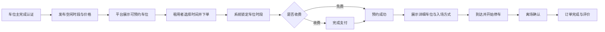

# 邻里车位共享平台整体方案

- 文档状态：初稿
- 版本：0.1.0
- 更新日期：2026-08-14

## 1. 产品定位

邻里车位是一个面向住宅小区及周边车主的车位共享平台。车位拥有者可以发布确定的空闲时段，附近没有固定车位的车主可以预约免费或有偿车位。

产品首先解决三个问题：

1. 车位在什么时间真实可用。
2. 车位和发布者是否可信。
3. 预约成功后如何顺利进入小区并停到正确位置。

## 2. 用户角色

| 角色 | 主要能力 |
| --- | --- |
| 找车位的人 | 查询、预约、入场、离场、支付、评价 |
| 车位共享者 | 认证车位、设置空闲时间、价格和使用规则 |
| 物业管理员 | 审核车位、管理小区、处理异常和投诉 |
| 平台管理员 | 用户、订单、支付、风控、配置和审计 |

## 3. MVP 范围

第一版仅服务一个或几个合作小区，以微信小程序为首发端，优先验证免费共享场景。

### 3.1 找车位端

- 微信登录、手机号绑定和车牌管理。
- 按小区、当前位置和停车时间查询。
- 地图及列表展示车位。
- 查看距离、可用时段、价格、认证状态和入场方式。
- 提交预约、取消预约、到达确认和离场确认。
- 查看进行中及历史订单。
- 评价和异常申诉。

### 3.2 车位共享端

- 实名及小区住户认证。
- 上传车位证明，由物业或平台审核。
- 设置车位编号、车辆尺寸限制和入场说明。
- 创建周期性或临时空闲时段。
- 选择免费、按小时收费或按次收费。
- 查看预约日历、收益和历史记录。

### 3.3 管理后台

- 小区、楼栋和停车区域管理。
- 用户与车位认证审核。
- 订单、取消、超时和投诉处理。
- 免费/收费模式和平台服务费配置。
- 敏感操作审计日志、黑名单和风险用户管理。

### 3.4 第一版不做

- 余额钱包和充值。
- 动态定价、优惠券和复杂会员体系。
- 智能道闸、车位锁等硬件集成。
- 全国范围运营。

## 4. 核心业务流程



## 5. 关键业务规则

### 5.1 防止重复预约

创建订单时必须在服务端数据库事务中锁定车位并检查时间交叉。前端展示的“可预约”仅用于交互提示，不能作为最终判断依据。

### 5.2 隐私保护

未预约前只展示小区入口附近位置；预约成功后才展示地下层、车位编号和入场说明。手机号、车牌和住址必须脱敏，车位证明不得公开访问。

### 5.3 时间与取消规则

每笔预约前后允许配置缓冲时间。平台需要明确迟到、提前离场、超时占用、未到场、车位被占和无法入场的处理方式。支付及退款回调必须保证幂等。

### 5.4 认证规则

支持物业导入、产权/租赁证明上传和平台人工审核。车位未经审核不得公开发布。

## 6. 订单状态

```text
待支付 -> 已确认 -> 使用中 -> 已完成
   \-> 已取消 / 已退款 / 爽约 / 争议中
```

所有状态变化由服务端校验，并记录操作者、来源平台、时间和原因。

## 7. 技术架构

### 7.1 客户端

- uni-app + Vue 3 + TypeScript。
- Pinia 状态管理。
- SCSS 与统一设计变量。
- 请求、登录、支付、定位、上传和通知分别封装为平台适配器。
- 平台差异集中使用条件编译，禁止在业务页面散落大量平台判断。

uni-app 通过编译器和运行时将同一套代码编译到 Web、Android、iOS 和各类小程序。Vue 3 工程基于 Vite，平台差异可以使用条件编译处理：

- [uni-app 跨端原理](https://uniapp.dcloud.net.cn/tutorial/index.html)
- [uni-app CLI 快速上手](https://uniapp.dcloud.net.cn/quickstart-cli)
- [uni-app 条件编译](https://uniapp.dcloud.net.cn/tutorial/platform.html)
- [uni-app Pinia](https://uniapp.dcloud.net.cn/tutorial/vue3-pinia.html)

### 7.2 服务端

- Spring Boot REST 服务。
- MySQL 8 存储业务主数据。
- Redis 用于预约锁、验证码和短期缓存。
- 对象存储用于车位证明和现场图片。
- JWT + Refresh Token 与 RBAC 权限控制。
- OpenAPI 提供接口文档。
- Docker Compose 支持本地及私有化部署。

地图、微信登录、支付、短信和对象存储必须定义供应商适配接口，开源使用者可以替换实现。

### 7.3 管理后台

管理后台使用 Vue 3 + TypeScript + Vite，与客户端共享接口类型和业务状态枚举。第一版重点完成审核、订单和投诉流程。

## 8. 核心数据模型

| 实体 | 主要内容 |
| --- | --- |
| `user` | 用户、实名状态、风险状态 |
| `vehicle` | 用户车辆和脱敏车牌 |
| `community` | 小区、入口和地理范围 |
| `community_member` | 用户与小区的认证关系 |
| `parking_space` | 车位、审核状态、限制条件 |
| `availability_slot` | 可共享起止时间和价格方式 |
| `booking` | 预约时间、状态、金额和取消原因 |
| `payment` / `refund` | 支付、退款及回调流水 |
| `check_record` | 到达、离场和凭证 |
| `review` | 双方评价 |
| `complaint` | 投诉及处理记录 |
| `audit_log` | 管理端敏感操作日志 |

## 9. 多端发布策略

1. 微信小程序：小区群传播和首轮验证。
2. H5：车位详情分享和运营活动。
3. Android/iOS：用户规模和消息需求稳定后发布。
4. 鸿蒙及其他小程序：根据实际用户量增加。

`uni.requestPayment` 可以统一客户端支付调用，但各平台仍需要独立申请、配置商户能力并完成服务端下单：[支付文档](https://uniapp.dcloud.net.cn/api/plugins/payment.html)。定位属于隐私权限，不同端涉及地图 Key、坐标系和域名白名单：[定位文档](https://uniapp.dcloud.net.cn/api/location/location.html)。

## 10. 收费能力路线

1. 免费共享验证真实需求和违约率。
2. 增加收费预约、支付和原路退款。
3. 增加车位主结算、平台服务费和对账。

正式启用收费前，需要确认运营主体、车位收益结算方式、物业规则、发票税务及纠纷责任。开源版本只提供支付接口和模拟实现，不包含真实商户密钥。

## 11. 衡量指标

- 有效共享车位数和共享时长。
- 搜索到预约的转化率。
- 预约成功率和订单完成率。
- 取消率、爽约率和超时率。
- 投诉率及平均处理时长。

## 12. 实施节奏

1. 产品规则、原型、数据库和接口设计。
2. 免费共享 MVP，在单个小区试运行。
3. 支付、退款、结算和风控。
4. App、H5、消息推送和物业系统对接。
